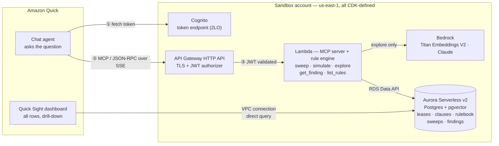
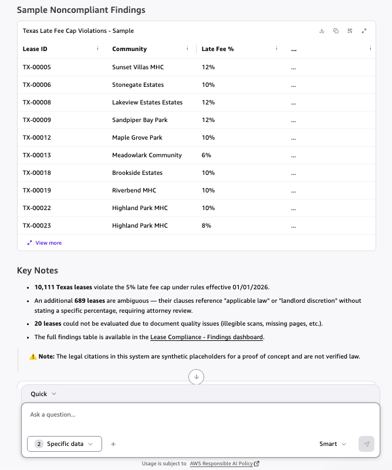
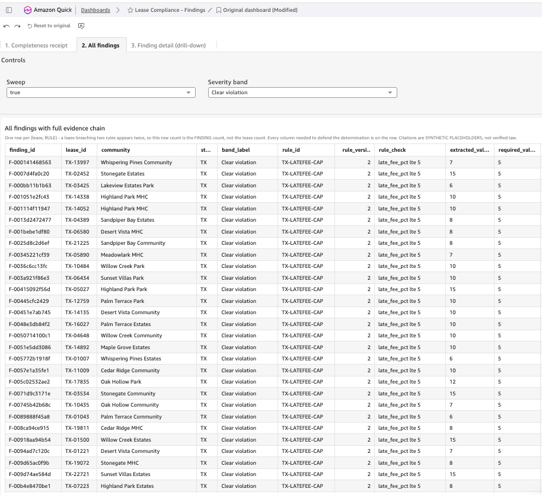
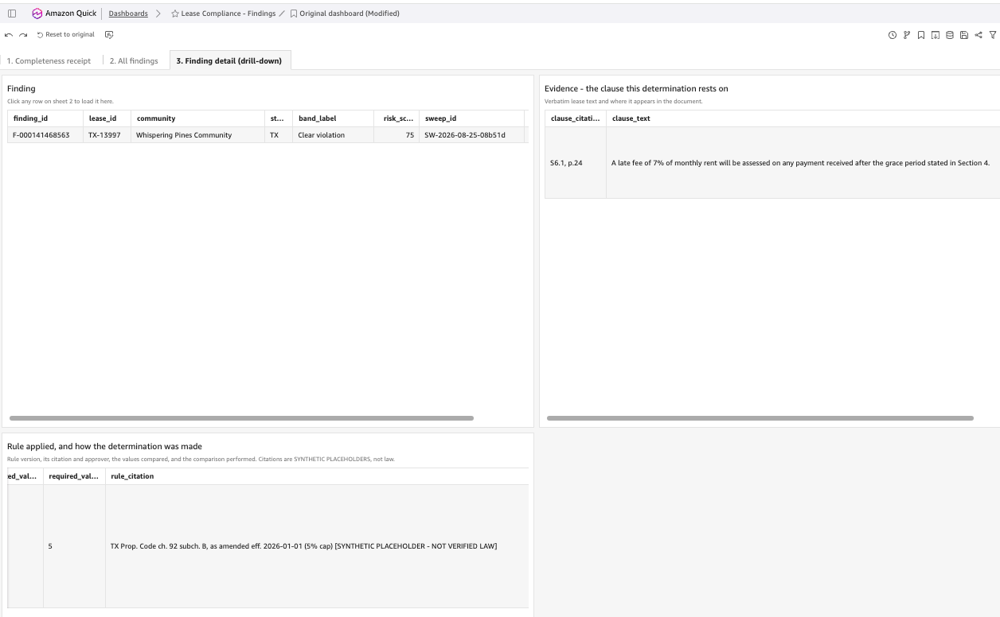

# Quick PoC — lease compliance in Amazon Quick

> **Not production-ready.** This is a proof-of-concept demonstrating mechanism only, intended for
> educational purposes. It has passed an internal security review, but the legal rules and
> citations are invented placeholders and the data is synthetic. Do not deploy this code, or reuse
> its patterns, in a production environment without additional security testing, and not against
> real lease/tenant data without independent legal validation of any rule content.

This is a proof-of-concept demonstrating a lease-compliance workflow as a natural-language
experience inside Amazon Quick: a user asks a question like "Which Texas leases violate the late
fee cap?" in Quick chat, and the system runs an exhaustive, deterministic compliance sweep over a
large synthetic population, returning a completeness receipt (every lease accounted for as
compliant, noncompliant, ambiguous, or unreadable) plus a sample, with full detail available in a
linked Quick Sight dashboard — backed by an MCP server on Lambda behind Cognito 2LO auth, with
compliance rules living as versioned data rather than code, SQL built only from a fixed
operator→template table with rule values bound as parameters, and any AI use (embeddings for
exploratory clause search) kept strictly separate from the deterministic compliance determinations.

## What runs where



**Both surfaces read the same store.** Chat carries the completeness receipt and a link; the
dashboard carries the volume, because 10,800 rows do not render in a chat message. Note that Bedrock
is called from the Lambda and only by `explore_clauses` — no model is involved in any sweep, and
Aurora never calls a model.

## What the answer looks like

Asked in Quick chat: *"Which Texas leases violate the late fee cap? Use rules effective 01/01/2026."*



The chat surface answers with a sample, the completeness receipt as counts (10,111 violations, 689
ambiguous, 20 unreadable), the `ILLUSTRATIVE`/synthetic-data caveat, and a link into the dashboard —
it deliberately does not try to render all 10,111 rows.



The dashboard is where the volume lives: every finding, filterable by sweep and severity band, with
every column needed to defend the determination already on the row.



Drilling into one row surfaces the underlying evidence: the verbatim lease clause on one side, the
rule version, citation, and compared values on the other — `TX-LATEFEE-CAP` version 2, the 5% cap
effective 2026-01-01, still carrying its `[SYNTHETIC PLACEHOLDER - NOT VERIFIED LAW]` tag at the row
level.

## Files

| Path | What it is |
|---|---|
| `app.py`, `infra/stack.py` | CDK: Cognito 2LO, HTTP API + JWT authorizer, Lambda, Aurora, Quick Sight networking |
| `mcp_server/handler.py` | JSON-RPC 2.0 over streamable HTTP. **SSE framing is mandatory for Quick** |
| `mcp_server/tools.py` | The five-tool contract. Tool descriptions are load-bearing |
| `mcp_server/engine.py` | Rule→SQL translation, set-based sweep, computed receipts |
| `mcp_server/explore.py` | Titan embeddings, pgvector ranking, parallel Claude classification |
| `mcp_server/db.py` | RDS Data API access + rule resolution (returns a **list**, never one rule) |
| `db/schema.sql`, `db/views.sql`, `db/rulebook.json`, `db/migrate.py` | Schema, dashboard views, 19 versioned rules, migration |
| `gen_corpus.py` | 50K synthetic leases with **counted, seeded** violations → `manifest.json` |
| `ingest.py` | Loads the corpus, embeds the exploratory clauses |
| `setup_dashboard.py` | Quick Sight VPC connection, data source, datasets, dashboard |
| `acceptance.py` | The one test suite: 28 checks against the **deployed** stack |
| `show_payload.py` | Prints a raw tool payload |
| `smoke_local.py` | Protocol checks with no AWS calls |
| `verify_deployed.py` | Token + handshake checks against the **deployed** stack, no AWS calls beyond that |
| `requirements.txt` | Pinned Python dependencies for the CDK app and all local scripts |
| `LICENSE` | MIT-0 |

## Setup from scratch

Prerequisites: [mise](https://mise.jdx.dev/) (or Node 24 by any other means), the [AWS CLI v2](https://docs.aws.amazon.com/cli/latest/userguide/getting-started-install.html)
with credentials already configured (`aws sts get-caller-identity` should succeed), and Python 3.9+.
Run everything below from the repo root.

```bash
python3 -m venv .venv && .venv/bin/pip install -q -r requirements.txt
eval "$(mise env -s zsh)"                                  # Node 24; Node 18 is EOL for CDK
export CDK_DEFAULT_ACCOUNT=$(aws sts get-caller-identity --query Account --output text)
npx aws-cdk@2.261.0 bootstrap aws://$CDK_DEFAULT_ACCOUNT/us-east-1   # pinned to match requirements.txt
npx aws-cdk@2.261.0 deploy --outputs-file outputs.json      # ~11 min (Aurora)

.venv/bin/python db/migrate.py        # schema, rulebook, views   (7 checks)
.venv/bin/python gen_corpus.py        # deterministic corpus + manifest
.venv/bin/python ingest.py            # load + embed  (~5 min, 11 checks)
.venv/bin/python setup_dashboard.py   # Quick Sight wiring
.venv/bin/python acceptance.py        # 28 checks against the live stack
```

Then register the MCP integration in Quick — see below.

## Registering (and re-registering) the Quick MCP integration

**Quick snapshots the tool list at registration time.** Adding a tool, renaming one, or editing a
tool *description* is invisible to Quick until the integration is **deleted and recreated**. There is
no refresh. Deploying the Lambda is not enough.

Print the four inputs (none are secret; the secret is fetched separately and never written to disk):

```bash
python3 -c "
import json; o=json.load(open('outputs.json'))['QuickPocStack']
for k in ('McpUrl','TokenEndpoint','ClientId','Scope'): print('%-14s %s' % (k, o[k]))
print('\nrun this for the client secret:'); print('  ' + o['ClientSecretCommand'])"
```

That prints the four fields plus the exact command for the secret, which resolves to:

```bash
aws cognito-idp describe-user-pool-client \
  --user-pool-id <from Issuer> --client-id <ClientId> \
  --query UserPoolClient.ClientSecret --output text
```

Read from Cognito each time and never written to disk. Copy it into Quick directly rather than into
a file or a shell variable.

Then in Quick: **Settings → Capabilities → MCP servers**. Delete the existing entry first if one
exists, then create a new one with those values (OAuth client-credentials / 2LO).

**Verify afterwards, in this order.** Re-registration touches the tool routing every demo moment
depends on, so do not skip to the demo:

```bash
.venv/bin/python show_payload.py check_connection   # transport alive, touches no data
.venv/bin/python acceptance.py                      # 28/28 over the same SSE transport Quick uses
```

Then in Quick chat, confirm **tools/list shows 6 tools** and re-ask one question per routing path,
because acceptance proves the *server* works and not that Quick *picks* the right tool:

| Ask | Should invoke |
|---|---|
| "Which Texas leases violate the late fee cap? Use 2026-07-31." | `sweep_compliance` |
| "Find Texas clauses that read like liability waivers." | `explore_clauses` |
| "What if the Texas late fee cap dropped to 3%?" | `simulate_rule_change` |

**If re-registration goes wrong, the demo still stands.** Moments 1–4 and 6 run on the four
originally registered tools. Drop the what-if (moment 5) and the rest is unaffected — so a demo date
never depends on this succeeding.

**Do not test in the first seconds after a `cdk deploy`.** After `UpdateFunctionCode` a warm
container briefly serves the *old* code, so a correct fix can appear to fail twice and then pass
unchanged. Wait, then retest, before concluding anything is broken.

## The tools

| Tool | Result means |
|---|---|
| `sweep_compliance` | **Exhaustive.** Every lease in the jurisdiction accounted for in a computed receipt. Writes official findings. `as_of_date` required, never defaulted |
| `simulate_rule_change` | **What-if.** One rule tested at a PROPOSED value against the approved baseline, with directional counts (newly noncompliant / newly compliant). Labelled `EXPLORATORY`. Records nothing at all — no findings, no sweep row |
| `explore_clauses` | **Ranked sample.** Top K by similarity within a filtered population. Labelled `INTERPRETIVE`. Cannot answer "how many". Writes nothing |
| `get_finding` | One finding's complete evidence chain |
| `list_rules` | The rulebook in force on a date, with versions, citations, approvers |
| `check_connection` | Liveness only, touches no data. First thing to try when something breaks |

All read-only with respect to the compliance record. Filing a review, an override, or a rule change
is a human act requiring a named reviewer and reason, and is deliberately not exposed as a tool.

## Design rules that are not negotiable

- **Rules are data.** A law change is a `rulebook.json` row. The engine knows four generic operators
  (`gte`, `lte`, `equals`, `exists`) and contains no jurisdiction- or topic-specific branch.
- **No natural language reaches SQL.** Operators select fixed SQL templates; rule values bind as
  parameters. A hallucinated `WHERE` clause could silently narrow a population.
- **Deterministic before AI.** A numeric comparison answers the sweep; no model is consulted.
- **Exact filtering for completeness, vectors only for ranking.** Similarity never decides
  membership.
- **Receipts are computed, never written by hand**, and the invariant
  (`compliant + noncompliant + ambiguous + not_evaluated == scanned`) is asserted before a sweep
  commits.
- **Unreadable documents are named, not dropped.** Every lease lands in exactly one bucket.
- **Findings are append-only.** No `UPDATE` or `DELETE` against `findings` exists in the codebase.

## Hard-won details worth not rediscovering

- **Quick's MCP client requires SSE framing.** Answering `accept: text/event-stream` with plain
  `application/json` completes the handshake with HTTP 200s and then fails at agent-attach with
  "One or more parameters is invalid" — an error naming no field. Cost four registration attempts.
- **Quick's errors are not diagnostic.** The request/response logging in the Lambda is permanent
  infrastructure, not debug scaffolding; it is the only ground truth.
- **Quick snapshots the tool list at registration.** Changing tools requires deleting and recreating
  the integration.
- **A summarising LLM will strip a caveat and extrapolate from a sample.** Quick removed an
  `ILLUSTRATIVE:` citation prefix and presented an invented citation as statute, and inferred a
  population-wide range from 20 preview rows. Fixes: caveat as an un-strippable bracketed suffix
  repeated at several payload levels, and real aggregates supplied so the model need not guess.
  **A safeguard in the payload is only as strong as its survival through paraphrase.**
- **Quick Sight's VPC connection security group needs inbound on ALL TCP ports** from the database's
  group — return-packet destination ports are randomly allocated. Otherwise: "The connection attempt
  failed", with no further detail.
- **`update_dashboard` silently drops permissions.** A dashboard whose first create failed
  server-side stays permanently unopenable while the API reports it healthy. Grant permissions on
  every run.
- **`describe_dashboard` returns the *published* version**, so a fresh update reports the old
  version's errors and your fix looks like it did nothing. Poll the version you just submitted.
- **`CREATE OR REPLACE VIEW` cannot insert a column mid-list** — it leaves the old definition and
  reports success. Views are dropped before creation.
- **CDK's `AuroraPostgresEngineVersion` enum tracks CDK's release date, not RDS availability.**
  `VER_16_6` no longer exists in us-east-1; the version is pinned with `of("16.14", "16")`.
- **JSONB scalars decode as strings.** A rule value of `12` arriving as `"12"` would make numeric
  comparisons lexical — `"9" > "12"`.

## Cost and teardown

Aurora min capacity is 0.5 ACU (~$0.06/hr) so it never auto-pauses — a scale-to-zero cluster makes
the first question of a session fail while it resumes. No NAT gateway. Between demo windows, set
`serverless_v2_min_capacity=0` and redeploy, or `npx aws-cdk@2.261.0 destroy`.

The corpus is deterministic, so a rebuilt stack reproduces identical demo numbers.

## Data

Synthetic only, and it stays that way. No real customer lease data in this account. Legal
citations in `db/rulebook.json` are invented placeholders labelled as such in the file, in every API
response, and in the dashboard views — approver names are fictional.
